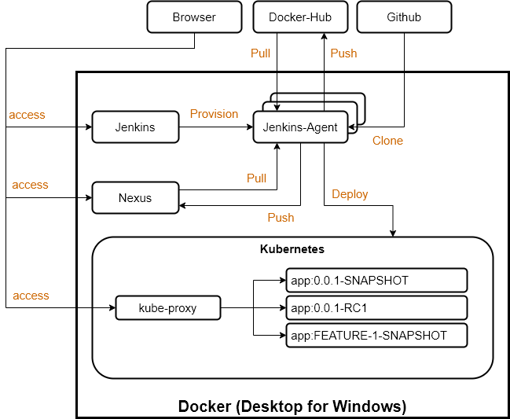

= Git in Software Development

This repository holds the sample application for illustrating Git in Software Development.

// TODO: Add presentation ro repository and link it here

== Description

This repository provides a sample application which is build in Jenkins to illustrate the relation of Git Branches, Versions and CI/CD. 

== Technologies

* link:https://git-scm.com/[Git 2.xx.x]
* link:https://docs.docker.com/[Docker 19.03.x]
* link:https://docs.docker.com/compose/[Docker Compose 1.25.x]
* link:https://kubernetes.io[Kubernetes 1.18.x]

== Description

This repository holds the sample application and infrastructure used for illustrating the relation of Git Branches, Versions and CI/CD in action. The infrastructure consists of the following services and platforms.

* Docker
* Kubernetes
* Jenkins CI/CD
* Jenkins Docker JNLP Agent
* Nexus Repsoitory Manager

.Infrastructure

== Preparations

=== Docker Hub

You will need a link:https://hub.docker.com/[Docker Hub] account, where the built Container Images are pushed during the builds.

=== Github

You will need a link:https://github.com/[Github] account and a link:https://help.github.com/en/enterprise/2.17/user/github/authenticating-to-github/creating-a-personal-access-token-for-the-command-line[personal access token] for your user, which is used to clone the repository.

=== Windows Host

Install ``Docker Desktop for Windows`` as described link:https://hub.docker.com/editions/community/docker-ce-desktop-windows[here]. +

Ensure that 

* the daemon is exposed via ``tcp://localhost:2375``,
* that the ``C`` drive is shared
* and that ``Kubernetes`` is started.

IMPORTANT: ``Docker Desktop for Windows`` will create the Kubernetes configuration file ``~/.kube/config`` which you will need to provide as a secret file.

=== WSL 2 (Ubunut 20.04.LTS)

Install ``Docker`` as described link:https://docs.docker.com/engine/install/ubuntu/[here]. +

IMPORTANT: If you start a docker container and get the error message ``cgroups: cannot find cgroup mount destination: unknown.``. Apply the temporary fix as described link:https://github.com/microsoft/WSL/issues/4189[here]

.Temporary fix for the mount issue
[source,bash]
----
sudo mkdir /sys/fs/cgroup/systemd
sudo mount -t cgroup -o none,name=systemd cgroup /sys/fs/cgroup/systemd
----

Install ``kind`` as described link:https://kind.sigs.k8s.io/docs/user/quick-start/[here].

.Install Kubernetes within Docker
[source,bash]
----
# With a custom configuration to bind the api server to '0.0.0.0:6443'
kind create cluster --config ../kind.yml
----

IMPORTANT: ``kind`` will install Kubernetes in Docker and create the Kubernetes configuration file ``~/.kube/config`` which you will need to provide as a secret file. 

=== WSL 2 (DEbian 10.x)

Install ``Docker`` as described link:https://docs.docker.com/engine/install/debian/[here], or use my link:https://github.com/cchet/wsl2-setup[ansible bundle] for setting up a Debian WSL2 instane.

Install ``kind`` as described link:https://kind.sigs.k8s.io/docs/user/quick-start/[here].

TIP: The ansible bundle will already install kind and fix the systemd mount issue for you

.Temporary fix for the mount issue
[source,bash]
----
sudo mkdir /sys/fs/cgroup/systemd
sudo mount -t cgroup -o none,name=systemd cgroup /sys/fs/cgroup/systemd
----

IMPORTANT: ``kind`` will install Kubernetes in Docker and create the Kubernetes configuration file ``~/.kube/config`` which you will need to provide as a secret file. 

=== Configurations

===== Secret Files

Create the following secret files which are used in the link:docker/docker-compose.yml[docker/docker-compose.yml] file. The content of the files is the secret value.

* ``docker/secrets/kubeConfig.txt`` +
  The base64 encoded Kubernetes config file. +
  *Ensure that only the configuration of the intended cluster is contained*
* ``docker/secrets/nexusPassword.txt`` +
  The nexus password
* ``docker/secrets/dockerHubPassword.txt`` +
  The Docker Hub password
* ``docker/secrets/githubAccessToken.txt`` +
  The Github access token
* ``docker/secrets/jenkinsAdminPassword.txt`` +
  The Jenkins administrator password

==== Env File 

The following environment variables needs to be defined for docker-compose. The simplest way to provide them is to create a ``.env`` file in the ``./docker`` directory. 

* ``DOCKER_HOST_URI`` +
  The Docker Host URI in the form of ``tcp://<HOST>:<PORT>``
* ``JNLP_JENKINS_URL`` +
  The Jenkins URL used by the jnlp docker agent in the form of ``http://<HOST>:<PORT>``
* ``JNLP_NEXUS_URL`` +
  The Nexus URL used by the builds within a jnlp docker agent in the form of ``http://<HOST>:<PORT>``
* ``RUN_AS`` +
  Defines with which use the jenkins container shall run. Either ``root`` or ``jenkins``
* ``JENKINS_PORT`` +
  The port Jenkins is exposed to
* ``GITHUB_USERNAME`` +
  Your github username
* ``NEXUS_PORT`` +
  The port Nexus shall be exposed to
* ``DOCKER_HUB_REGISTRY_REPOSITORY`` +
  The docker Hub repository name
* ``DOCKER_HUB_USERNAME`` +
  The docker Hub username
* ``KUBERNETES_URL`` +
  The api url of your Kubernetes cluster
* ``JENKINS_AGENT_IMAGE_TAG`` +
  Either you use by build ``cchet/jenkins-inbound-agent-custom:1.0`` available on Docker Hub or you build it yourself ``agent/Dockerfile`` and make it avialable to your Docker environment

IMPORTANT: With Docker Desktop for Windows set the environment varibales to: + 
``DOCKER_HOST_URI=tcp://host.docker.internal:2375`` +
``RUN_AS=root`` +
``JNLP_JENKIS_URL=http://host.docker.internal:<JENKINS_PORT>`` +
``JNLP_NEXUS_URL=http://host.docker.internal:<NEXUS_PORT>`` +
``KUBERNETES_URL=https://kubernetes.docker.internal:6443`` +
With WSL 2 set the environment varibales to: + 
``DOCKER_HOST_URI=tcp://<DOCKER0_IP>:2375`` +
``RUN_AS=jenkins`` +
``JNLP_JENKIS_URL=http://<DOCKER0_IP>:<JENKINS_PORT>`` + 
``JNLP_NEXUS_URL=http://<DOCKER0_IP>:<NEXUS_PORT>`` +
``KUBERNETES_URL=https://<DOCKER0_IP>:6443`` +
See link:https://stackoverflow.com/questions/31324981/how-to-access-host-port-from-docker-container[here] why

Example configuration files are located at link:doc/examples/[doc/examples/]. 

* link:doc/examples/.wsl-linux-env[Environment settings  WSL - Linux] +
  The ``.env`` file for WSL 2 and Linux environments
* link:doc/examples/.docker-desktop-env[Environment settings Docker Desktop for Windows] +
  The ``.env`` file for Windows environments
* link:doc/examples/kubeConfig.yml[Kubernetes Config] +
  The Kubernetes Configuration file
  
==== Kubernetes Dashboard (Optional)

. Install the dashboard +
  ``kubectl apply -f https://raw.githubusercontent.com/kubernetes/dashboard/v2.0.1/aio/deploy/recommended.yaml``
. Start the ``kube-proxy`` +
  ``kubectl proxy``
. List the secrets in the ``kubernetes-dashbaord`` namespace +
  ``kubectl get secret -n kubernetes-dashboard``
. Get the secret token from the service account name like ``kubernetes-dashboard-token-xxxxx`` + 
  `` kubectl describe secret kubernetes-dashboard-token-xxxxx  -n kubernetes-dashboard``
. Go to ``localhost:8001/api/v1/namespaces/kubernetes-dashboard/services/https:kubernetes-dashboard:/proxy/`` and login with the retrieved token

IMPORTANT: If you start the Kubernetes Proxy from within a WSL 2 instance, then you need to add the parameter ``--address 0.0.0.0``, otherwise you won't be able to access it from the Windows host.

== Setup

. Go to ``./docker/``
. Execute ``docker-compose build``
. Execute ``docker-compose up -d``
. Execute ``docker-compose exec nexus cat /opt/sonatype/sonatype-work/nexus3/admin.password`` to get the generated admin password
. Go to ``http://localhost:<NEXUS_PORT>``
. Login with ``admin:<INITIAL_PASSWORD>``
. Follow the wizard and define the new admin password ``NEXUS_PASSWORD``
. Go to ``http://localhost:<JENKINS_PORT>``
. Login with ``admin:<JENKINS_ADMIN_PASSWORD>``
. Got to the build job and see how they went
. Go to ``http://localhost:<NEXUS_PORT>/#browse/browse`` and see the pushed snapshot/release artifacts, which have a different version depending on the branch they have been build from
. Go to ``https://hub.docker.com/repository/docker/<DOCKER_HUB_REGISTRY_REPOSITORY>/microservice-quarkus`` and see the pushed images, which have a different tag depending on the branch they have been build from
. Go to ``http://localhost:8001/api/v1/namespaces/kubernetes-dashboard/services/https:kubernetes-dashboard:/proxy/`` and login with the Kubernetes Secret token and see if the deployments were successful.

IMPORTANT: The first time your defined ``NEXUS_PASSWORD`` was most likely invalid, because you haven't changed it before the builds started. Just trigger all of the builds and it will work 